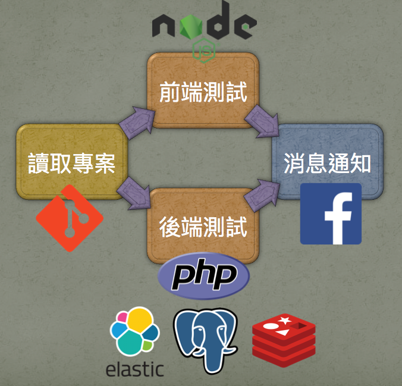

# Laravel + Drone

[Drone](https://github.com/drone/drone) is a Continuous Delivery system built on container technology. Drone uses a simple yaml configuration file, a superset of docker-compose, to define and execute Pipelines inside Docker containers.

## Screenshots



```yml
clone:
  git:
    image: plugins/git
    depth: 50
    tags: true

pipeline:
  frontend:
    image: node:8.1.2
    group: laravel
    commands:
      - node -v
      - npm -v
      - yarn --version
      - yarn config set cache-folder .yarn-cache
      - yarn install
      - yarn run production

  backend:
    image: laradock/workspace:1.8-71
    group: laravel
    commands:
      - php -v
      - composer -V
      - cp .env.example .env
      - composer install --prefer-dist
      - php artisan key:generate
      - php artisan migrate
      - ./vendor/bin/phpunit

  fb:
    image: appleboy/drone-facebook
    pull: true
    secrets: [ fb_page_token, fb_verify_token ]
    to: 1234973386524610
    when:
      event: [ push, pull_request ]
      status: [ success, failure ]

services:
  elasticsearch:
    image: docker.elastic.co/elasticsearch/elasticsearch:5.3.0

  redis:
    image: redis:latest

  postgres:
    image: postgres:9.5.5
    environment:
      - POSTGRES_DB=homestead
      - POSTGRES_USER=homestead
      - POSTGRES_PASSWORD=secret
```

## Testing your Drone config

Please try the following command to test drone config in local machine.

```sh
$ drone exec
``` 
